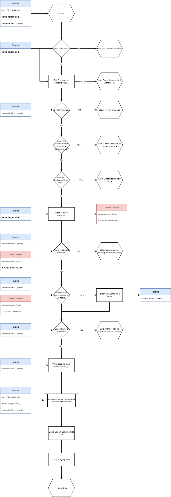

# dbUpsert

The dbUpsert package provides functions that interact with SQL databases
to “upsert” (update and/or insert) dataframe objects in R environments
to a table in a SQL database. Separately the package provides functions
to handle `UPDATE` statements to tables in SQL using R dataframes. The
package is built on top of the [DBI](https://github.com/r-dbi/DBI)
package and uses its underlying functions to write table data and send
SQL statements to the server.

This package is ideal for data pipeline tasks, or ETL processes in R.

Currently supported RDBMS’s include:

-   postgresql
-   Microsoft SQL Server (with limitations)

Planned support for RDMBS’s include:

-   MySQL
-   Any ANSI SQL backend

The end goal is to make this package completely ANSI SQL compliant.
However, in order to implement most of the error handling, this package
queries data from the SQL information schema. Each RDMBS handles
tracking primary keys differently, and this makes the fully ANSI SQL
version difficult to accomplish. Eventually, compromises will be made,
with richer feature sets for the supported RDBMS’s.

## Installation

Currently, this package is only available by installing from github, or
building from source. To install from github, you must first have the
`devtools` package installed.

``` r
library(devtools)
install_github("timeddilation/dbUpsert")
```

## Details

The functions contained in this package handle the interactions with the
database to get information about the target SQL table. This includes
getting the columns from a table, their data types, null-ability, and
which column(s) are used for the primary key.

In order to get the full functionality of this package, one must connect
to the SQL database with a user account that can create tables, read and
write to tables, and query the DB’s information schema.

In all cases, regardless of the RDBMS being used, the generated SQL
statements that actually perform the inserts and updates are ANSI SQL
standard.

### Upsert Table

The `dbUpsertTable()` function allows one to insert and update data from
an R dataframe object (or any object that can be coerced as one) to a
single target table in a SQL database. There are some stipulations for
this to work, however.

-   The target SQL table must have a primary key
-   The target SQL table’s primary key cannot be an identity/sequence
-   You must provide the primary key values to insert or update by in
    your table value

In addition, inserts and update are handled by column names in your R
dataframe. The names in your dataframe must be an exact match to the
column names in the SQL table. While this works in the majority of
cases, ANSI SQL permits spaces in column names, whereas R’s dataframe
does not. Although you should not have spaces in your SQL table column
names, if you do, you can use R’s `data.table` library instead of base
dataframes to circumvent this.

Currently, only postgresql is fully supported, and \[MS\] SQL Server is
partially supported. This is due to the error checking and automating
the function parameters the package does prior to sending any data to
the SQL database.

The functions will will display an error if any non-nullable values are
missing or the column(s) for the primary key is missing. The function
will warn you if you provide columns that do not exist in the target SQL
table, but will perform the upsert anyways.



### Update Table

The `dbUpdateTable()` function will try to automatically update the
target SQL table by primary key or identity unless otherwise specified.
One may specify columns manually to join by to perform the update.
